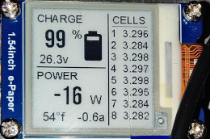

# esphome-jbd-bms


[](https://www.buymeacoffee.com/syssi)

ESPHome component to monitor and control a JBD-BMS via UART-TTL or BLE

## Supported devices

* JBD-SP04S034 200A 4S V1.3 (JBD-SP04S034-L4S-200A-B-U)
* JBD-SP04S020 120A 4S (JBD-SP04S020-L4S-120A-B-U-K, reported by [@Bretthansenpc](https://github.com/syssi/esphome-jbd-bms/issues/1#issuecomment-1133964580))
* JBD-SP04S020A 80A 4S (JBD-SP04S020A-L4S-80A-B-U, reported by [@kevin-jake](https://github.com/syssi/esphome-jbd-bms/issues/14))
* JBD-SP10S009 100A 8S (JBD-SP10S009-L8S-100A-B-K, reported by [@the-butterfry](https://github.com/syssi/esphome-jbd-bms/discussions/17))
* JBD-SP15S020 60A 13S (JBD-SP15S020-P13S-60A-B, reported by [@it-koncept](https://github.com/syssi/esphome-jbd-bms/discussions/17#discussioncomment-4632315))
* JBD-SP22S001 250A 20S (JBD-SP22S001-L20S-250A, reported by [@KNB-EP](https://github.com/syssi/esphome-jbd-bms/issues/59))
* JBD-SP22S003A 40A 22S (JBD-SP22S003A-L22S-40A, reported by [@Microguy31](https://github.com/syssi/esphome-jbd-bms/discussions/17#discussioncomment-5876098))
* JBD-SP22S003A 50A 22S (JBD-SP22S003A-L22S, reported by [@johkn](https://github.com/syssi/esphome-jbd-bms/discussions/17#discussioncomment-5942928))
* JBD-AP20S006 200A 20S (JBD-AP20S006-L20S-200A-B, reported by [@rk125](https://github.com/syssi/esphome-jbd-bms/discussions/16))
* JBD-AP21S001 150A 20S (JBD-AP21S001-L20S-150A-B, reported by [@yarosman](https://github.com/syssi/esphome-jbd-bms/issues/25))
* JBD-AP21S001 200A 21S (JBD-AP21S001-L21S-200A-B, reported by [@cctweaker](https://github.com/syssi/esphome-jbd-bms/discussions/17#discussioncomment-6026019))
* JBD-AP21S002 200A 21S (JBD-AP21S002-L21S-200A-B, reported by [@Zahnpasta83](https://github.com/syssi/esphome-jbd-bms/issues/44))
* JBD-DP04S007 100A 4S (JBD-DP04S007-L4S-100A, reported by [@reflexsa](https://github.com/syssi/esphome-jbd-bms/discussions/20))
* JBD-SP18S 100A 18S (JBD-SP18S-100A-086, reported by [@mobilex-Godelmann](https://github.com/syssi/esphome-jbd-bms/discussions/17#discussioncomment-5061954))
* Basen BG-24100, 8S 24V 100A battery pack (JDB-SP16S020-100A, reported by [@teunito](https://github.com/syssi/esphome-jbd-bms/discussions/17#discussioncomment-5836709))
* CLRD LFP-82460-COMM, 8S 24V 60A battery pack (15710026-SP10S020-L8S-50A-50AH, reported by [@andrewww173](https://github.com/syssi/esphome-jbd-bms/issues/4#issuecomment-1188292512))
* Overkill JBD-SP25S003 100A 16S (JBD-SP25S003-L16S-100A-100A-B, reported by [@Uksa007](https://github.com/syssi/esphome-jbd-bms/issues/31))
* LIONTRON LiFePO4 LX 12.8V 40Ah (LISMART1240LX, reported by [@jassi0001](https://github.com/syssi/esphome-jbd-bms/issues/81))
* LIONTRON LiFePO4 LX 12.8V 55Ah (LISMART1255LX, reported by [@jassi0001](https://github.com/syssi/esphome-jbd-bms/issues/81))

## Untested devices

Untested but probably supported devices:

* JBD-SP04S028 60/80/100/120/150A 4S
* JBD-SP04S005 4S 150A
* JBD-SP05S002 4S 80A
* JBD-SP15S001 14S 60A

## Requirements

* [ESPHome 2024.6.0 or higher](https://github.com/esphome/esphome/releases).
* Generic ESP32 or ESP8266 board

## Schematics

```
                RS485-TTL
┌──────────┐                ┌─────────┐
│          │<----- RX ----->│         │
│ JBD-BMS  │<----- TX ----->│ ESP32/  │
│          │<----- GND ---->│ ESP8266 │<-- 3.3V
│          │                │         │<-- GND
└──────────┘                └─────────┘


│                JBD-BMS                   │
│                                          │
│                          UART   Balancer │
└─────────────────────────[oooo]──[ooooo]──┘
                            │││
                            │││      (ESP32)
                            │││
                            ││└─ GND (GND)
                            │└── RXD (GPIO4)
                            └─── TXD (GPIO5)

```

Connector 4 Pin, JST PA 2.0mm pitch

## Installation

You can install this component with [ESPHome external components feature](https://esphome.io/components/external_components.html) like this:
```yaml
external_components:
  - source: github://syssi/esphome-jbd-bms@main
```

or just use the `esp32-example.yaml` as proof of concept:

```bash
# Install esphome
pip3 install esphome

# Clone this external component
git clone https://github.com/syssi/esphome-jbd-bms.git
cd esphome-jbd-bms

# Create a secrets.yaml containing some setup specific secrets
cat > secrets.yaml <<EOF
wifi_ssid: MY_WIFI_SSID
wifi_password: MY_WIFI_PASSWORD

mqtt_host: MY_MQTT_HOST
mqtt_username: MY_MQTT_USERNAME
mqtt_password: MY_MQTT_PASSWORD
EOF

# Validate the configuration, create a binary, upload it, and start logs
# If you use a esp8266 run the esp8266-examle.yaml
esphome run esp32-example.yaml

```

If you are a Home Assistant user without any ESPHome experience yet please take a look at the [beginners guide](docs/beginners-guide.md).

## Example response all sensors enabled

```
[D][uart_debug:114]: >>> DD:A5:03:00:FF:FD:77
[D][uart_debug:114]: <<< DD:03:00:1D:06:0B:00:00:01:ED:01:F4:00:00:2C:7C:00:00:00:00:10:00:80:63:02:04:03:0B:A0:0B:9D:0B:98:FA:55:77
[D][sensor:124]: 'jbd-bms-uart total voltage': Sending state 15.47000 V with 2 decimals of accuracy
[D][sensor:124]: 'jbd-bms-uart current': Sending state 0.00000 A with 1 decimals of accuracy
[D][sensor:124]: 'jbd-bms-uart power': Sending state 0.00000 W with 1 decimals of accuracy
[D][sensor:124]: 'jbd-bms-uart capacity remaining': Sending state 4.93000 Ah with 2 decimals of accuracy
[D][sensor:124]: 'jbd-bms-uart nominal capacity': Sending state 5.00000 Ah with 2 decimals of accuracy
[D][sensor:124]: 'jbd-bms-uart charging cycles': Sending state 0.00000  with 0 decimals of accuracy
[I][jbd_bms:243]:   Date of manufacture: 2022.3.28
[D][sensor:124]: 'jbd-bms-uart balancer status bitmask': Sending state 0.00000  with 0 decimals of accuracy
[D][sensor:124]: 'jbd-bms-uart errors bitmask': Sending state 4096.00000  with 0 decimals of accuracy
[D][text_sensor:067]: 'jbd-bms-uart errors': Sending state 'Mosfet Software Lock'
[D][sensor:124]: 'jbd-bms-uart software version': Sending state 8.00000  with 1 decimals of accuracy
[D][sensor:124]: 'jbd-bms-uart state of charge': Sending state 99.00000 % with 0 decimals of accuracy
[D][sensor:124]: 'jbd-bms-uart operation status bitmask': Sending state 2.00000  with 0 decimals of accuracy
[D][sensor:124]: 'jbd-bms-uart battery strings': Sending state 4.00000  with 0 decimals of accuracy
[D][sensor:124]: 'jbd-bms-uart temperature 1': Sending state 24.50000 °C with 1 decimals of accuracy
[D][sensor:124]: 'jbd-bms-uart temperature 2': Sending state 24.20000 °C with 1 decimals of accuracy
[D][sensor:124]: 'jbd-bms-uart temperature 3': Sending state 23.70000 °C with 1 decimals of accuracy
[D][uart_debug:114]: >>> DD:A5:04:00:FF:FC:77
[D][uart_debug:114]: <<< DD:04:00:08:0F:23:0F:1C:0F:12:0F:1D:FF:4E:77
[D][sensor:124]: 'jbd-bms-uart cell voltage 1': Sending state 3.87500 V with 3 decimals of accuracy
[D][sensor:124]: 'jbd-bms-uart cell voltage 2': Sending state 3.86800 V with 3 decimals of accuracy
[D][sensor:124]: 'jbd-bms-uart cell voltage 3': Sending state 3.85800 V with 3 decimals of accuracy
[D][sensor:124]: 'jbd-bms-uart cell voltage 4': Sending state 3.86900 V with 3 decimals of accuracy
[D][sensor:124]: 'jbd-bms-uart min cell voltage': Sending state 3.85800 V with 3 decimals of accuracy
[D][sensor:124]: 'jbd-bms-uart max cell voltage': Sending state 3.87500 V with 3 decimals of accuracy
[D][sensor:124]: 'jbd-bms-uart max voltage cell': Sending state 1.00000  with 0 decimals of accuracy
[D][sensor:124]: 'jbd-bms-uart min voltage cell': Sending state 3.00000  with 0 decimals of accuracy
[D][sensor:124]: 'jbd-bms-uart delta cell voltage': Sending state 0.01700 V with 4 decimals of accuracy
[D][sensor:124]: 'jbd-bms-uart average cell voltage': Sending state 3.86750 V with 4 decimals of accuracy
```

## Protocol

See [Jiabaida.communication.protocol.pdf](docs/Jiabaida.communication.protocol.pdf)

## Known issues

None.

## Goodies

### E-paper status display

A user of this project ([@the-butterfry](https://github.com/the-butterfry)) shared some YAML code for [a beautiful status display using a 1.54 e-paper display here](https://github.com/syssi/esphome-jbd-bms/discussions/19).



### Preserving your battery pack

[@TheNexter](https://github.com/TheNexter) contributed a [YAML snippet to stop charging of his e-scooter at an early stage](yaml-snippets/esp32-ble-deepsleep-limit-charging-automation.yaml) to preserve the battery pack. The automation doesn't require a network connection and is executed on the ESP itself. To save some capacity the `deep_sleep` component is used.

## Debugging

If this component doesn't work out of the box for your device please update your configuration to enable the debug output of the UART component and increase the log level to the see outgoing and incoming serial traffic:

```
logger:
  level: DEBUG

uart:
  id: uart_0
  baud_rate: 9600
  tx_pin: ${tx_pin}
  rx_pin: ${rx_pin}
  debug:
    direction: BOTH
```

## References

* https://github.com/ioBroker/AdapterRequests/issues/512
* https://github.com/sshoecraft/jbdtool/blob/main/jbd.c
* https://gitlab.com/bms-tools/bms-tools
* https://gitlab.com/bms-tools/bms-tools/-/blob/master/JBD_REGISTER_MAP.md
* https://github.com/kolins-cz/Smart-BMS-Bluetooth-ESP32
* https://github.com/ForrestFire0/GenericBMSArduino
